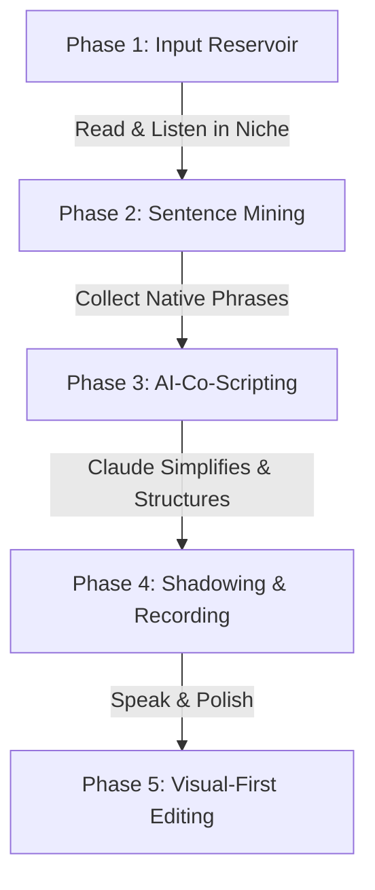

# The Comprehensible Input YouTube Blueprint
## How to Learn English, Build Your Channel, and Dominate Your Niche Simultaneously

Starting a YouTube channel in English when you are not fully fluent is actually an **incredible unfair advantage** if you approach it correctly. 

Traditionally, **Comprehensible Input (CI)**—the language acquisition theory popularized by linguist Stephen Krashen—states that we acquire language when we understand messages (input) that are just slightly above our current level (known as $i + 1$). 

To create content while learning, we must transition from **Passive Comprehensible Input** to **Active Comprehensible Production**. This blueprint shows you exactly how to do that, leveraging your computer science background and high-fidelity SaaS visual skills to bypass language barriers and build a stunning YouTube channel.

---

## 1. The Core Philosophy: "Visual-First, Simple English"

Many non-native creators make the mistake of trying to speak like native fast-talkers. This leads to high cognitive load, mistakes, and frustration. 

Instead, you will adopt the **Premium Explainer Aesthetic**:
* **The Principle**: When your visuals are mind-blowing (which is your strength with tools like Canva, Remotion, Three.js, and high-quality UI design), your voiceover **should** be simple, slow, and punchy.
* **The Formula**: **Ultra-Premium Visuals + Slow, Extremely Clear, Plain English.**
* **The Magic**: Slow, clear speech with simple words actually makes you sound *more* authoritative, professional, and accessible to a global audience. Think of channels like *Apple product ads* or tech explainers—they do not use complex vocabulary; they use simple, powerful sentences.

---

## 2. The Active CI Workflow (Learn -> Script -> Shadow)

To learn English while creating videos, you will turn your research phase into your language acquisition phase.



### Phase 1: Building your Niche Input Reservoir
* **Action**: Consume 30–60 minutes of English content in your niche (SaaS, startup marketing, indie hacking, AI video creation) every day.
* **Source**: Read articles on Medium/Substack, watch successful YouTube creators in your space, listen to podcasts (like *Indie Hackers*, *My First Million*).
* **The CI Benefit**: Because you already understand the *concepts* (programming, design, SaaS business models), your brain will easily map the English vocabulary to your existing knowledge. This makes the input highly comprehensible!

### Phase 2: "Sentence Mining"
* **Action**: Keep a simple Notion page or text file called `My Niche Phrasebook`.
* **What to capture**: Whenever a native speaker says something in a simple but elegant way, copy the entire sentence. 
  * *Example*: Instead of writing down the word "leverage", write down the phrase: *"We can leverage this tool to automate..."*
* **The CI Benefit**: You are acquiring language in **chunks and contexts**, not isolated vocabulary words. This prevents you from translating in your head when you speak.

### Phase 3: Co-Scripting with Claude (Interactive Scripting)
When you write your YouTube scripts, use Claude as your language-partner. You provide the ideas, and Claude structures them to match your speaking ability.

> **The "Fluency-Matching" Claude Prompt:**
> ```markdown
> Act as a professional scriptwriter and English coach. I want to write a YouTube script about [Your Video Topic]. 
> My English is intermediate, and I want to speak slowly, clearly, and naturally. 
> 
> Here are my rough thoughts/points:
> [Paste your raw notes, ideas, or bullet points in your current English]
> 
> Please output:
> 1. A highly engaging YouTube script based on my notes.
> 2. Use short, simple, high-impact sentences (max 10-12 words per sentence).
> 3. Avoid complex idioms or words that are difficult to pronounce.
> 4. Use "active verbs" and standard industry phrasing.
> 5. Include phonetic pronunciation hints in brackets for any tricky niche words.
> ```

### Phase 4: Shadowing and Teleprompter Practice
Before you hit record, you must practice speaking the script using the **Shadowing Technique** (mimicking a voice) combined with a teleprompter:
1. **TTS Audition**: Run your scripted text through a high-quality Text-to-Speech tool (like ElevenLabs or even natural reader voices) to hear exactly how a native speaker pronounces the script.
2. **Shadowing**: Listen to the audio and speak *simultaneously* with it, matching the rhythm, pauses, and intonation. Do this 3 to 5 times.
3. **Teleprompter App**: Use a free teleprompter tool (like *CapCut's built-in teleprompter* or *Elegant Teleprompter*). Set the speed to **slow** (around 110–130 words per minute). 
4. **Speak on Camera / Mic**: Read from the teleprompter. Because your sentences are short, you will have plenty of room to breathe and maintain eye contact.

---

## 3. The "Non-Native Creator's" Production Tech Stack

To make up for any pronunciation or confidence issues, use modern software tools that serve as your digital speech therapist:

| Tool | Purpose for Non-Native Speakers | How to Use It |
| :--- | :--- | :--- |
| **ElevenLabs** (Optional) | Voice Generation or Voice-to-Voice | If you are extremely self-conscious, you can record your voice in your native/accented English and use **Speech-to-Speech (STS)**. It converts your exact voice rhythm and emotion into a perfect native English accent. |
| **Adobe Podcast AI** | Audio Enhancement | It instantly removes background noise and makes your mic sound like a professional studio. It also smooths out slight mouth noises/mumbling. (It's free). |
| **Descript / CapCut** | Word-Level Video Editing | These editors transcribe your video. If you stutter, repeat a word, or take too long to think, you can simply delete that text, and the software cuts the video flawlessly. |
| **CapCut Auto-Captions** | visual Subtitles | YouTube viewers watch on mute or use captions to help understand. Using dynamic, styled captions (like the "Alex Hormozi" style) keeps people engaged even if they miss a spoken word. |

---

## 4. Turning the Niche Content into an English School

If you look at your `blueprint.md` for **ContentCore Studio**, your niche is **helping B2B SaaS startups show up consistently on social media using AI-powered carousels and reels**. 

You can turn your YouTube channel's focus into an incredibly compelling story:

### Content Angle 1: The "CS Student/Builder" Journey (Highly Relatable)
* **The Hook**: *"I am building a SaaS design agency in English, which is my second language. Here is exactly how I do it."*
* **Why it works**: Audiences absolutely love authenticity. When you state upfront, *"My English isn't perfect, but my designs and results are,"* you build instant trust. SaaS founders care about **results**, not accent perfection. In fact, speaking slowly makes you sound technical and trustworthy.

### Content Angle 2: High-Quality, Visual-Dominant Tutorials
* **The Hook**: Show, don't just talk. Create screen-recordings showing your Canva layouts, Claude prompting, or coding templates. 
* **The Strategy**: Let your screen do the talking. You only need to speak to explain the *steps*. 
  * *Example Sentence structure*: *"Step 1. Open Claude. Enter this prompt. Look at the result. Step 2. Go to Canva. Apply the template."*
  * This is clean, actionable, and incredibly easy for you to speak!

---

## 5. Your 30-Day Step-by-Step Action Plan

Here is a simple roadmap to launch your channel using this method:

### Week 1: Setup and "Input Mining"
* [ ] Create your YouTube channel (choose a clean, premium name like *ContentCore Studio* or *[Your Name] - SaaS Builder*).
* [ ] Setup an English Input routine: Watch 3 tech/SaaS videos daily (e.g., *Justin Welsh*, *Alex Cattoni*, or high-quality SaaS explainers).
* [ ] Set up a notion database or simple file `english_mine.md` to collect 20 powerful, simple phrases you hear in those videos.

### Week 2: First Script & Co-Authoring
* [ ] Pick your first video topic. (Example: *"How I design a SaaS carousel in 10 minutes using AI"*).
* [ ] Write the outline of the steps in your current English.
* [ ] Run the outline through Claude using the **Fluency-Matching Prompt** above.
* [ ] Review the simplified script. Read it aloud. Mark any words that make you trip. Ask Claude to replace those specific words with simpler synonyms.

### Week 3: Shadowing & Recording
* [ ] Paste the final script into a Text-to-Speech tool to hear the natural cadence.
* [ ] Shadow-read the script 5 times until your tongue feels comfortable with the flow.
* [ ] Set up your camera/screen recorder and teleprompter.
* [ ] Record the voiceover slowly. Take deep breaths. If you mess up, **do not stop recording**—just pause for 3 seconds and say the sentence again. You will cut the bad take later.

### Week 4: Editing, Captions & Upload
* [ ] Import your footage into CapCut or Descript. 
* [ ] Cut out all silent spaces, stutters, and double-takes using the transcription editor.
* [ ] Layer in gorgeous visuals: screenshots of your work, zoom-ins, or dynamic screen captures. 
* [ ] Apply CapCut's automated captions. Style them with a nice, legible font (like *Inter* or *Outfit*), dynamic colors, and smooth animations.
* [ ] Export, upload to YouTube, and write a simple description using Claude.

---

## 6. Golden Rules for Non-Native Speakers

1. **Slow is Smooth, and Smooth is Professional**: Never try to speak fast. Professional narrators speak slowly. Aim for a calm, confident pace.
2. **Subtitles are Mandatory**: Always burn styled subtitles into your videos or use auto-captions. It guarantees 100% comprehension for your viewers, regardless of your accent.
3. **Embrace Your Accent**: A clean, clear non-native accent is a sign of intelligence and bilingual capability. It sets you apart from the sea of generic native creators. If your content is valuable and your visuals are premium, people will subscribe.
4. **Learn by Teaching**: Explaining SaaS concepts in English to an audience is the absolute fastest way to master the language. You are getting paid (eventually) to learn English!
